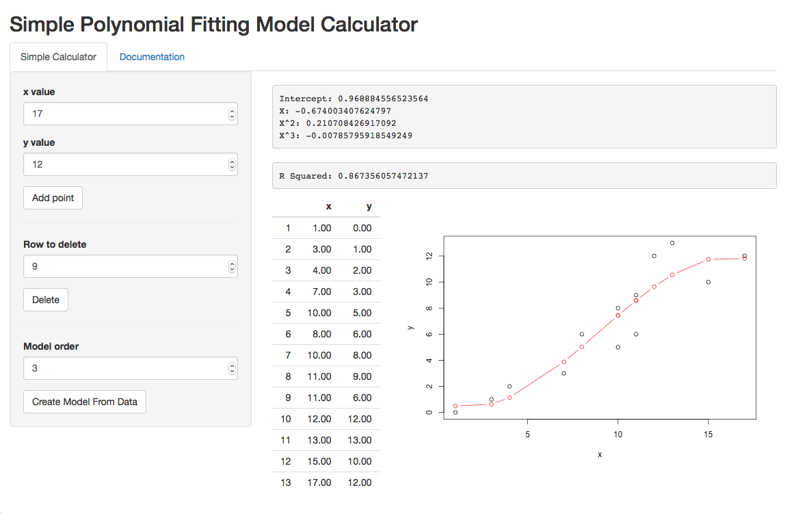

```{r setup, include=FALSE}
knitr::opts_chunk$set(echo = FALSE)
```

## Introduction

- This product is created as requirement in the coursera Developing Data Products Course project. 

- A simple polynomial fitting model calculator has been developed. This tool allows to the user to add the points and selectt the order model. 

- As output the user will get the the model plot, the model coefficients and the R squared value in order to give an idea how the model fits the data. 

## How it works
- The app takes the the input fields and append them to an internal dataset

- Dinamically when a new data is appended to the dataset, the plot is updated and the visual dataset.

- When the user press the generate model button, the app run the following model instruction and report the data results:
```
model <- lm(y ~ poly(x,{input$orderModel}, raw=TRUE))
```


## Screenshot
- Following is an screenshot from the application:


## Conclusions

As it can be observed the Shiny development environment allows to create a great variety of web applications based on R studio even if the user doesn't have any html experience. 

